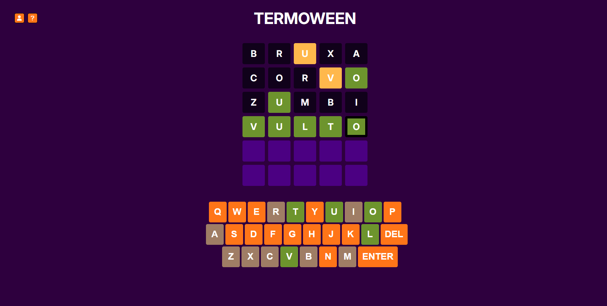

# 🎃 Termoween

**Termoween** é um jogo de adivinhação de palavras inspirado no clássico **Wordle**, mas com temática de **Halloween**!

## 🕯️ Sobre o Projeto

Este projeto foi desenvolvido como parte de um **trabalho para a disciplina de Sistemas para Internet II**. A proposta é recriar a mecânica do Wordle — um jogo de adivinhar palavras — com uma **temática diferente**. Além da ambientação, todas as palvras se encaixam com o tema da Noite das Bruxas.

🧡 **Tema:** Halloween  
💀 **Estilo:** Dark, divertido e misterioso  
🕷️ **Base:** Jogo de lógica e vocabulário  

---

## 📸 Tela do Jogo

---

## 👻 Como Jogar

O objetivo é simples: você tem **6 tentativas** para adivinhar a **palavra secreta de 5 letras** relacionada ao Halloween.

Após cada tentativa, as cores dos blocos mudarão para indicar o quão perto você está:

* 🟩 **Verde:** A letra está na palavra e na **posição correta**.
* 🟨 **Amarelo:** A letra está na palavra, mas na **posição errada**.
* ⬛ **Escuro:** A letra **não faz parte** da palavra.

---

## 🧙 Tecnologias Utilizadas

- **HTML5**  
- **CSS3**  
- **JavaScript**  

---

### 🎨 Design (Figma)

Todo o layout e design da interface foram planejados no Figma antes da implementação.

* [Acesse o projeto no Figma](https://www.figma.com/design/WQCrZTLztPra38SIctESMd/trabalho-si2?node-id=0-1&t=w0MKslpsFzeOuMnb-1)